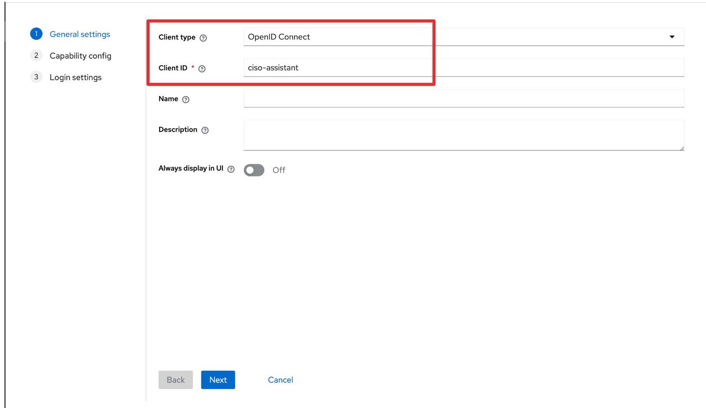

# Keycloak


<mark style="color:red;">If Keycloak and CISO Assistant are both deployed locally with docker, you'll need to make sure that both containers can communicate together. You can do this with a</mark> [<mark style="color:red;">bridge network</mark>](https://docs.docker.com/engine/network/drivers/bridge/)<mark style="color:red;">.</mark>




Go into your **Keycloak admin console**

1.  Open the sidebar menu > **Clients** and **Create client**

    <figure><figcaption></figcaption></figure>
2.  Choose **SAML** client type and name it **ciso-assistant** or with your custom <mark style="color:purple;">**SP Entity ID**</mark>

    <figure><figcaption></figcaption></figure>
3.  Fill the **Home URL** with your `<base_url>` and **Valid redirect URIs** with `<backend_url/*>`

    <figure><figcaption></figcaption></figure>

    If you have some problems to configure these urls you can ask for help on [Discord](https://discord.gg/8C4X7ndQQ4) or by emailing us
4.  Go into **Keys** and disable **Signing keys config**

    <figure><figcaption></figcaption></figure>
5.  Go into **Advanced** and fill **ACS field** with `<backend_url/api/accounts/saml/0/acs/>` (on a cloud instance it is simply `<base_url/api/accounts/saml/0/acs/>`)

    <figure><figcaption></figcaption></figure>
6.  Go to **Client scopes** and click on **ciso-assistant-dedicated**

    <figure><figcaption></figcaption></figure>
7.  **Add a predefined mapper** and check all **X500** ones

    <figure><figcaption></figcaption></figure>
8.  Click on **X500 surname** and replace **SAML Attribute name** with `http://schemas.xmlsoap.org/ws/2005/05/identity/claims/surname`

    <figure><figcaption></figcaption></figure>
9.  Click on **X500 givenName** and replace **SAML Attribute name** with `http://schemas.xmlsoap.org/ws/2005/05/identity/claims/givenname`

    <figure><figcaption></figcaption></figure>

10. Go into **Realm settings > General**, you will find the <mark style="color:purple;">**Metadata URL**</mark>

    <figure><figcaption></figcaption></figure>
11. You'll find inside the **Metadata URL** the <mark style="color:purple;">**Entity ID**</mark>\

    <figure><figcaption></figcaption></figure>




Go into your **Keycloak admin console**

1.  Open the sidebar menu > **Clients** and **Create client**

    <figure><figcaption></figcaption></figure>
2. Choose **OpenID Connect** client type and give it a **Client ID**, then click **Next**
3.  Enable **Client authentication**, make sure **Standard flow** is selected, then click **Next**.png>)

4. Enter your deployment's **Root URL**. It is the URL of your frontend.
   1. Set it to `<frontend_url>`&#x20;
   2. For cloud deployments, you must set it to `<base_url>`
5. Set the **Home URL** to **`/`**
6. Enter your **Valid redirect URIs**
   1. Set it to `<backend_url>/api/accounts/oidc/openid_connect/login/callback/`&#x20;
   2.  For cloud deployments, you must set it to `<base_url>/api/accounts/oidc/openid_connect/login/callback/`

       <figure><figcaption></figcaption></figure>
7.  Once your client is created, you can find its **Client secret** under the **Credentials** tab. You can copy it from there

    <figure><figcaption></figcaption></figure>
8.  Go into **Realm settings > General** to find the <mark style="color:purple;">**OpenID Endpoint Configuration**</mark><mark style="color:purple;">,</mark> which you will have to paste into CISO Assistant's **Server URL** SSO parameter

    <figure><figcaption></figcaption></figure>




<mark style="color:orange;">Adding a user in your application doesn't automatically create the user on CISO Assistant</mark>


You can now [configure CISO Assistant](https://intuitem.gitbook.io/ciso-assistant/features-highlights/sso#configure-ciso-assistant-with-saml) with the <mark style="color:purple;">**parameters**</mark> you've retrieved.
